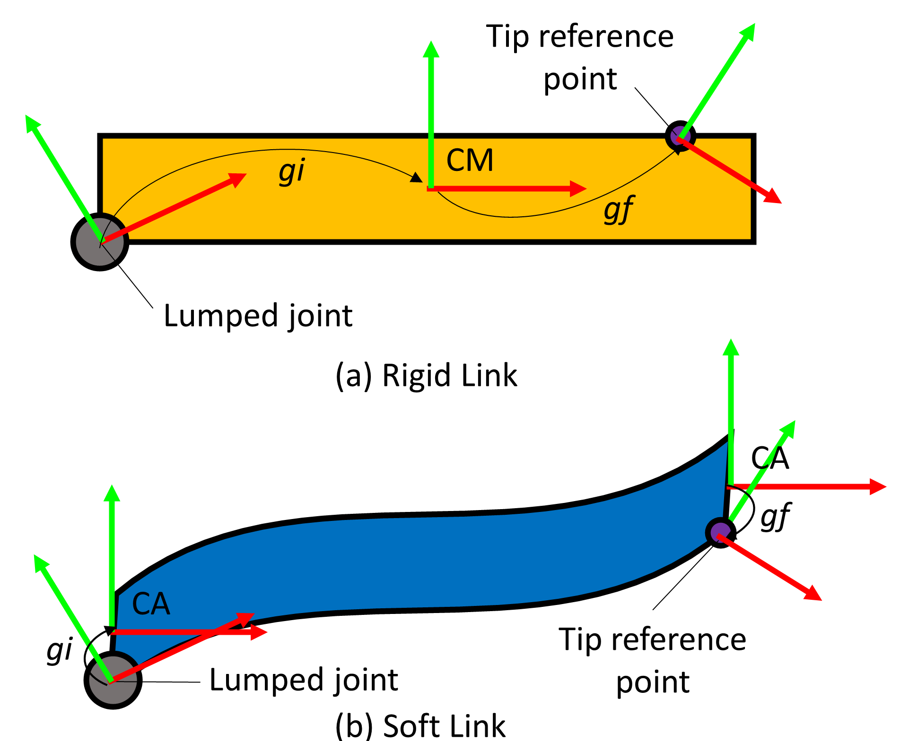

# SorosimLink
The SorosimLink class is used to define the different links that will be used to define the robot body. The links can then be combined to form various robots. The class variables that are used to define a link is broadly divided into three types:
 - General properties
 - Geometric properties
 - Material properties
 Of these, only some of them are user defined, the others will be computed based on the user-defined input

|     Type     |   Name    |    datatype     | Description                                                                                                                                                                                               |
| :----------: | :-------: | :-------------: | :-------------------------------------------------------------------------------------------------------------------------------------------------------------------------------------------------------- |
| user-defined | Jointtype |      char       | Joint type of the link: 'R' for revolute. 'P' for prismatic. 'H' for helical, ‘U’ for universal, ‘C’ for cylindrical, ‘A’ for planar, ‘S’ for spherical,<br>‘F’ for free motion, and ‘N’, for fixed joint |
| user-defined | LinkType  |      char       | Type of link: ‘s’ for soft body, ‘r’ for rigid body                                                                                                                                                       |
| user-defined |    CS     |      char       | Cross sectional shape: ‘C’ for circular and ‘R’ for rectangular, 'E' for elliptical.                                                                                                                      |
| ==computed== |   npie    |       int       | Number of pieces. For rigid links npie = 1; for soft links, npie = 1+number of divisions                                                                                                                  |
|              |           |                 |                                                                                                                                                                                                           |
|              |    lp     |   cell array    | length of each division of the link                                                                                                                                                                       |
| user-defined |     L     |      float      | total length of the link                                                                                                                                                                                  |
|   computed   |     r     | function handle | A function of x, that returns the radius of the cross section at x, \(x\in [0,1]\)                                                                                                                        |
|              |     h     | function handle | A function of x, that returns the height of the cross section at $x \in [0,1]$                                                                                                                            |
|              |     w     | function handle | A function of x, that returns the width of the of the cross section at $x\in [0,1]$                                                                                                                       |
|              |     a     | function handle | A function of x, that returns the semi-major axis of the cross section at $x\in[0,1]$                                                                                                                     |
|              |     b     | function handle | A function of x, that returns the semi-minor axis of the cross section at $x\in[0,1]$                                                                                                                     |
|   Computed   |    cx     |      float      | local translation in the x direction from the base frame to center of mass.                                                                                                                               |
|              |    gi     |   \\(SE(3)\\)   | Transformation from the joint center to: (1) the center of mass for rigid link (2) center of area for soft link                                                                                           |
|              |    gf     |   \\(SE(3)\\)   | Transformation from the center of mass to the tip reference point.                                                                                                                                        |
|              |           |                 |                                                                                                                                                                                                           |
|              |     E     |      float      | Youngs modulus [Pa]                                                                                                                                                                                       |
|              |    Poi    |      float      | Poisson ratio                                                                                                                                                                                             |
|              |     G     |      float      | Shear modulus [Pa]                                                                                                                                                                                        |
|              |    Eta    |      float      | Material damping of soft link [Pa.s]                                                                                                                                                                      |
| user-defined |    Rho    |      float      | Density of the link [kg/m^3]                                                                                                                                                                              |
| user-defined |    Kj     |      float      | Joint stiffness matrix                                                                                                                                                                                    |
|              |    Dj     |      float      | joint damping Matrix                                                                                                                                                                                      |
|   computed   |     M     |                 | Inertia matrix for rigid links only                                                                                                                                                                       |
|              |           |                 |                                                                                                                                                                                                           |
|              |    n_l    |                 |                                                                                                                                                                                                           |
|              |    n_r    |                 |                                                                                                                                                                                                           |
|              |   color   |                 |                                                                                                                                                                                                           |
|              |    CPF    |                 |                                                                                                                                                                                                           |
|              |  PlotFn   |                 |                                                                                                                                                                                                           |
|              |  Lscale   |                 |                                                                                                                                                                                                           |

# SorosimLink definition
To define a sorosim link, the GUI can be used to define some of the class variables. All the other class variables are computed. 
A link can be instantiated by:
```
L1 = SorosimLink;
```
If an empty link is requied it can be created using
```
L1 = SorosimLink('empty')
```
This can be used when the links need to be defined programmatically. 

# Properties

The properties of the sorosimlink class can be classified into:

## General Properties of a Link

Properties that define the general characteristics of a link are grouped together as General Properties. These properties include:

- **Joint Type (`jointtype`)**: Specifies the type of lumped joint.
- **Body Type (`linktype`)**: Defines whether the link is rigid or soft.
- **Cross-Sectional Shape (`CS`)**: Describes the geometry of the link’s cross-section.
- **Number of Pieces (`npie`)**: Represents how the link is divided into segments. For a rigid link, `npie` is set to 1, corresponding to the joint. For a soft link, `npie` is equal to the **total number of divisions plus 1**.
- **Gauss Quadrature Parameters (`nGauss`, `Xs`, `Ws`)**: Used for numerical computations on soft links.
The **Gauss quadrature parameter** `nGauss{division_number}` specifies the total number of significant points in a soft division where computations occur. These points include the start and endpoints of the division. The parameters `Xs` and `Ws` correspond to the positions and weights of the Gauss quadrature points, respectively.

## Geometric Properties of a Link

Properties related to the geometry of a link fall under Geometric Properties. These include:

- **Piece-wise Length (`lp`)**: Length of individual soft link divisions.
- **Total Length (`L`)**: Overall length of the link.
- **Radius (`r`)**: For links with a circular cross-section.
- **Width (`w`) and Height (`h`)**: For links with a rectangular cross-section.
- **Semi-Major (`a`) and Semi-Minor (`b`) Axes**: For links with an ellipsoidal cross-section.
- **Initial (`gi`) and Final Transformation (`gf`) Matrices**: Define the transformation properties of the link. For rigid links, `gi` is the transformation from the joint to the CoM and `gf`  is the transformation from the CoM to the tip reference point. For a soft link, `gi` is the transformation from the joint to the center of cross section and `gf` is the transformation from the center of cross section to the tip reference point.

!!! note
    It must be noted that in rigid links, the radius (`r`), width (`w`), and height (`h`) are stored as numerical values and In soft links, these properties *(except for `L`)* are stored as cell elements, where each division of the link has a separate numerical value.

## Material Properties of a Link

Material Properties include the employed material’s:

- **Young’s Modulus (`E`)**: Measures the material's stiffness.
- **Poisson’s Ratio (`Poi`)**: Describes the material’s deformation in perpendicular directions under stress.
- **Density (`Rho`)**: Represents the mass per unit volume.
- **Material Damping (`Eta`)**: Accounts for energy dissipation in the material.

For rigid links, only the value of `Rho` is significant. Using these properties along with the Geometric Properties of the link, the program computes additional material parameters:

- **Shear Modulus (`G`)**: Measures the material’s response to shear stress.
- **Screw Inertia Matrix (`Ms`)**: Represents mass distribution.
- **Screw Stiffness Matrix (`Es`)**: Defines resistance to deformation.
- **Screw Damping Matrix (`Gs`)**: Models energy dissipation.

These derived quantities are also stored as Material Properties of the link.

!!! note
    For a rigid link, `Ms` represents the screw stiffness matrix (`M`) of the entire body.<br>
    For a soft link, `Ms`, `Es`, and `Gs` represent the cross-sectional inertia (`M`), stiffness (`E`), and damping (`G`) matrices, computed at every significant point of each division.
    In soft links, these matrices are stored as cell elements in the SorosimLink class.


