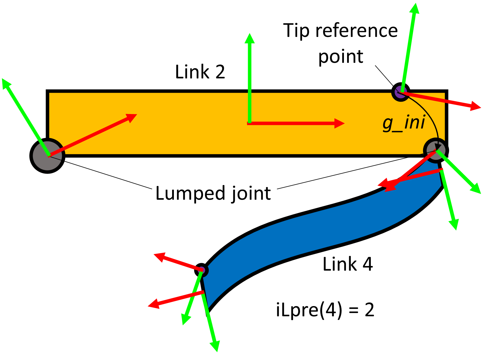

# SoroSimLinkage class
The SorosimLinkage class allows the user to combine the previously defined [[SorosimLink]] objects into various linkages. The linkage topology may be open, closed, branched etc. The external forces and actuation is also defined in this class. The toolbox provides various inbuilt functions that allows the user to define various types of forces and moments, even custom external forces can be modelled. 

## Linkage definition
To define a SorosimLinkage S1 from previously defined Sorosims L1 and L2, we simply instatiate a Sorosimlinkage as follows
```
S1 = SorosimLinkage(L1,L2)
```
This leads the user to a GUI that allows the definition of relative position and orientation of the two links with respect to other links in the linkage. 

| Type | Name             | datatype | Description                                                                                             |
| ---- | ---------------- | -------- | ------------------------------------------------------------------------------------------------------- |
|      | N                |          | Total number of links                                                                                   |
|      | ndof             |          | Total number of dofs                                                                                    |
|      | nsig             |          | Total number of points at which computation is performed  \(N +N_{rigid} +\sum(N_{soft_{div}}*n_gauss\) |
|      | nj               |          | Total number of virtual joints (rigid joints plus virtual joints of all soft rods)                      |
|      | VLinks           |          | Vector of unique links                                                                                  |
|      | LinkIndex        |          | Array of indices corresponding to each link.                                                            |
|      | CVTwists         |          | Cell vector of twists for each link.                                                                    |
|      | iLpre            |          | Array corresponding to the link index of the link that the ith link is connected to.                    |
|      | g_ini            |          | Homogenous transformation matrix of links with respect to the tip of the previous link.                 |
|      | Z_order          |          | Order of zannah collocation.                                                                            |
|      |                  |          |                                                                                                         |
|      | nCLj             |          | Number of closed loop joints.                                                                           |
|      | iACL             |          | Array corresponding to the index of link A                                                              |
|      | iCLB             |          | Array corresponding to the index of link B.                                                             |
|      | VTwistsCLj       |          | Array of twist vectors corresponding to each closed loop joint.                                         |
|      | gACLj            |          |                                                                                                         |
|      | gBCLj            |          |                                                                                                         |
|      | CLprecompute     |          |                                                                                                         |
|      | T_BS             |          |                                                                                                         |
|      |                  |          |                                                                                                         |
|      | Gravity          |          | Boolean value of 1 if gravity is present, 0 if it is not present                                        |
|      | G                |          | (6x1) vector of the value of acceleration due to gravity                                                |
|      |                  |          |                                                                                                         |
|      | PointForce       |          | Boolean 1 if point force is present, 0 if it is not present                                             |
|      | FollowerForce    |          | Boolean 1 if the force is defined in the local frame and 0 if it is defined in the global frame         |
|      | np               |          | Number of point forces.                                                                                 |
|      | Fp_loc           |          |                                                                                                         |
|      | Fp_vec           |          |                                                                                                         |
|      |                  |          |                                                                                                         |
|      | CEFP             |          |                                                                                                         |
|      | M_added          |          |                                                                                                         |
|      |                  |          |                                                                                                         |
|      | Actuated         |          |                                                                                                         |
|      | nact             |          |                                                                                                         |
|      |                  |          |                                                                                                         |
|      | Bqj1             |          |                                                                                                         |
|      | n_jact           |          |                                                                                                         |
|      | i_jact           |          |                                                                                                         |
|      | i_jactq          |          |                                                                                                         |
|      | Wrenchcontrolled |          |                                                                                                         |
|      |                  |          |                                                                                                         |
|      | n_sact           |          |                                                                                                         |
|      | dc               |          |                                                                                                         |
|      | dcp              |          |                                                                                                         |
|      | Sdiv             |          |                                                                                                         |
|      | Ediv             |          |                                                                                                         |
|      | Inside           |          |                                                                                                         |
|      | CableFunction    |          |                                                                                                         |
|      |                  |          |                                                                                                         |
|      | CAP              |          |                                                                                                         |
|      | CAS              |          |                                                                                                         |
|      |                  |          |                                                                                                         |
|      | K                |          |                                                                                                         |
|      | Damped           |          |                                                                                                         |
|      | D                |          |                                                                                                         |
|      |                  |          |                                                                                                         |
|      | CP1              |          |                                                                                                         |
|      | CP2              |          |                                                                                                         |
|      | CP3              |          |                                                                                                         |
|      |                  |          |                                                                                                         |
|      |                  |          |                                                                                                         |


# Linkage definition



# Class methods

### Bq = **ActuationMatrix**(Tr,q)
**Input**: Tr ([[SorosimLinkage]]), q (generalised coordintes) <br>
**Output**: Bq ()<br>


### dqdt=**derivatives**(Tr,t,qqd,uqt)
**Input**: Tr ([[SorosimLinkage]]), t(simulation time), qqd ( $\mathbb{R}^{2\times ndof}$ vector of generalised coordinates and its derivatives), ==uqt== <br>
**Output**: dqdt<br>

### [t,qqd] = **dynamics**(Tr,qqd0,odetype,dt)

### E=**Equilibrium**(Tr,qu,uq,magnifier,lsqoptions)

### D = **findD**(Tr,varargin)

### K = **findK**(Tr,varargin)

### g = **FwdKinematics**(Tr,q,i_here,j_here)
Computes the forward kinematics of the linkage. In general it is computed as: 

\\(gLpre \times gini\times g_{joint} \times gi \times gf\\) for rigid links

\\(gLpre \times gini\times g_{joint} \times gi \times \exp(\hat{\Omega}) \times gf\\) 

### C = **GeneralizedCoriolisMatrix**(Tr,q,qd)

### F = **GeneralizedExternalForce**(Tr,q,t,qd)

### M = **GeneralizedMassMatrix**(Tr,q)

### J = **Jacobian**(Tr,q,i_here,j_here)

### Jd = **Jacobiandot**(Tr,q,qd,i_here,j_here)

### **plotq**(Tr,q)

### **plotq0**(Tr,Lh,Dh,CLh)

### **plotqqd**(Tr,t,qqd)

### xi = **ScrewStrain**(Tr,q,i_here,j_here)

### eta = **ScrewVelocity**(Tr,q,qd,i_here,j_here)

### [q,u]=**statics**(Tr,qu0,magnifier)
